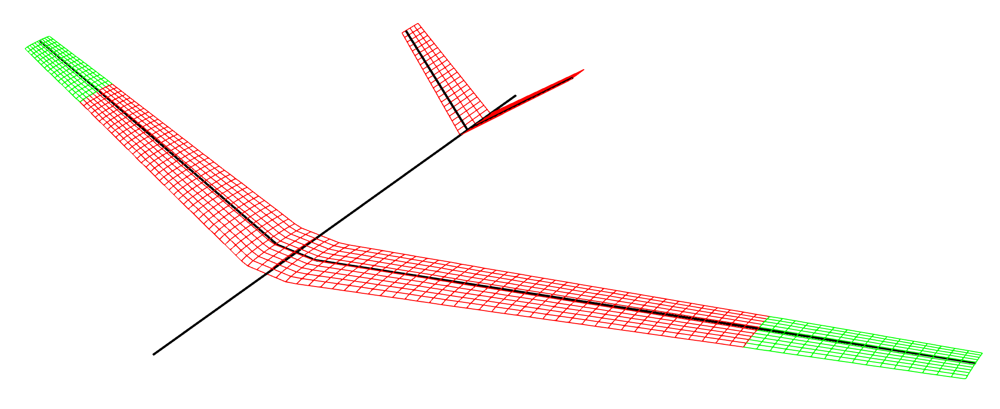

# Multibody FLEXOP Case for SHARPy

This is an extension of the FLEXOP model from which it is forked, to add multibody wingtips. Included in this model are three configurations for the wingtips:

1. Fixed swept wingtips. This is not a multibody problem, as the wingtips are swept in a fixed position. This can be 
particularly handy for trimming the aircraft due to the absence of a robust trim routine for the multibody solver. 
Please see an example test case [here](example_cases/free_fixed_sweep.py).
2. Actuated swept wingtips. This allows for the wingtips to be swept according to some input angle time series using 
```MultibodyController``` controllers coupled into the time domain simulation. An example case with a ramp angle input is 
given in the test case [here](example_cases/free_controlled_sweep.py).
3. Hinged wingtips. A hinge can be placed at an arbitrary angle between the main wing and the tips to allow them to move 
freely. Please see the free flying example of this case [here](example_cases/free_hinged.py), and the clamped version 
with just the wings [here](example_cases/clamped_hinged.py).

<p align="center">

 </p>

## Using the model
To create a model, use the class ```FlexopAeroelastic``` as below:

```python
from create_multibody_flexop import FlexopAeroelastic
model = FlexopAeroelastic(case_name, case_route, **settings)
```

where the settings dictionary defines all the editable parameters in the model, with examples of these settings being used shown in the example cases. This creates a model without constraints; for example to add a hinge constraint to the model:

```python
model.add_constraint('free_hinge', **constraint_settings)
```

where the constraint settings define the required parameters for the given constraint type. Other constraint types available are:
 -  ```free```: This can be applied to the main aircraft FoR to indicate no constraint, however it does not actually have an effect on the mode.
 - ```clamped```: Clamps the main aircraft FoR to create a wingtunnel-style model
 - ```fully_constrained```: Fixed the wingtips to the main aircraft and allows no displacement or rotation between them, therefore recovering the non-multibody aircraft.
 - ```prescribed_hinge```: Allows for an angle time series to be applied to each wingtip to allow them to be swept over time.
 - ```free_hinge```: Free hinge at a given angle.

To create the files required for simulation:
```python
model.generate_h5()
model.generate_settings()
```

Lastly to run the case:
```python
case_data = sharpy.sharpy_main.main(['', case_route + '/' + case_name + '.sharpy'])
```

where output data will both be written to files (Paraview data for the aero and structure), as well as data being retured in the ```case_data``` object. To use the JAX multibody solver, a version of SHARPy with this needs to be used, with an early version available [here](https://github.com/ImperialCollegeLondon/sharpy/tree/dev_jax_multibody). The free hinge and fixed sweep cases can be run on the original ```NonlinearDynamicMultibody``` solver using the settings ```'use_jax'=False```.
